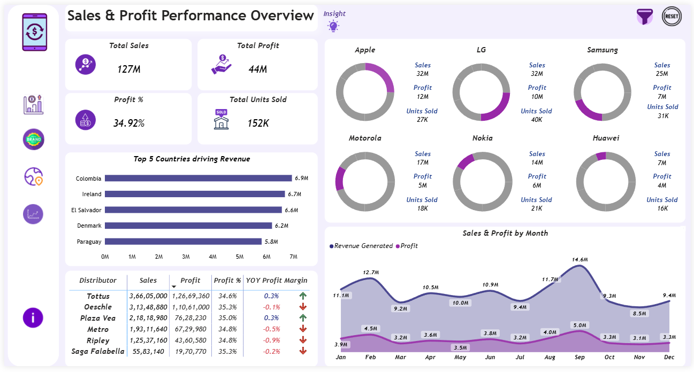
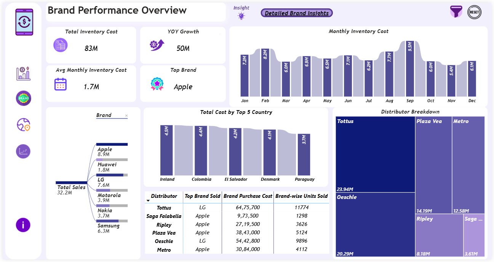
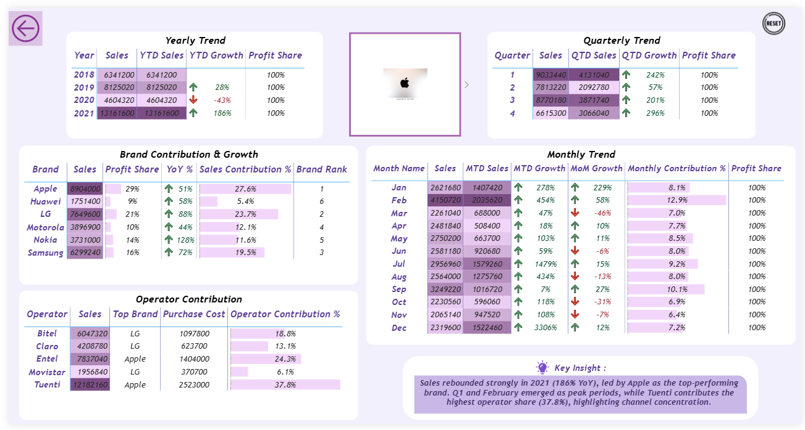
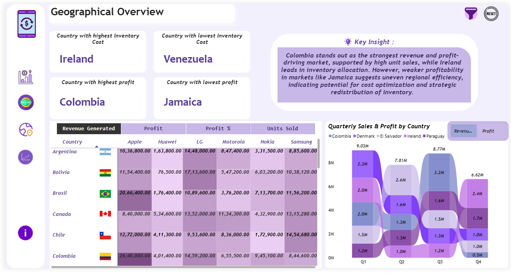
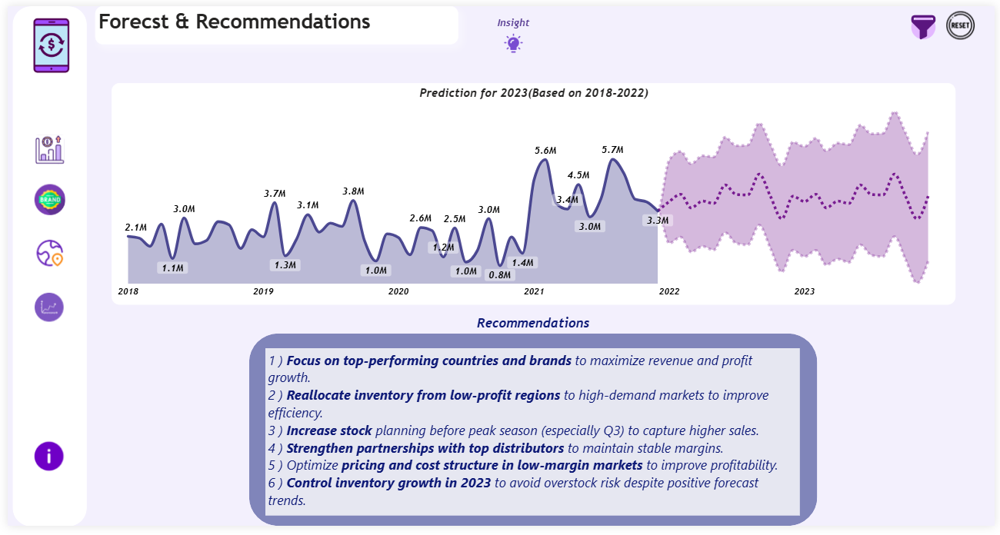

# Sales & Profit Performance Analysis Dashboard

## Project Objective
The objective of this project is to analyze sales performance, brand contribution, and regional profitability in order to identify revenue drivers and support data-driven business decisions.

---

## Project Overview
This project presents an interactive **Power BI dashboard** that analyzes sales, profit, inventory cost, and distributor performance across multiple brands and countries.  

The dashboard provides insights into business performance, market distribution, and growth trends, helping stakeholders understand where revenue is generated and where improvements can be made.

---

## Problem Statements
- Which brands generate the highest sales and profit?
- Which countries contribute the most to overall revenue?
- How do sales and profit vary across months and years?
- Which distributors drive the majority of product sales?
- How can forecasting help improve future business planning?

---

## Dataset
The dataset contains transactional sales records including:

- Brand
- Distributor
- Country
- Units Sold
- Sales Revenue
- Profit
- Inventory Cost

These fields were used to evaluate overall business performance, brand contribution, and regional profitability.

---

## Tools & Technologies
- Microsoft Power BI  
- Business Intelligence (BI)  
- Data Visualization  
- Exploratory Data Analysis (EDA)  
- Data Cleaning & Data Transformation  
- KPI & Metrics Development  

---

## Methods
The following analytical steps were performed:

1. Data preprocessing and validation.
2. Creation of KPIs such as **Total Sales, Total Profit, Profit %, highest and lowest performing countries and total units Sold**.
3. Brand-level and distributor-level performance analysis.
4. Monthly, quarterly, and yearly trend analysis.
5. Regional sales analysis using geographical insights.
6. Sales forecasting based on historical trends.

---

## Key Insights
- Total Sales reached approximately **127M** with **44M total profit**.
- **Apple emerged as the top-performing brand** in terms of sales and contribution.
- Countries like **Colombia and Ireland generated the highest revenue**.
- Distributor performance varied significantly, indicating differences in market reach.
- Sales trends showed seasonal fluctuations with noticeable peak periods.

---

## Dashboard Screenshots

### Sales & Profit Performance

### Brand Performance Overview

### Trend Analysis

### Geographical Overview

### Forecast & Recommendations

---

## How to Run This Project

1. Download the `.pbix` dashboard file from this repository.
2. Open the file using **Power BI Desktop**.
3. Navigate through the report pages to explore insights and interactive visuals.
4. Use filters and drill-through options to analyze advanced metrics and deep-dive information.

---

## Business Impact
This dashboard helps businesses:

- Identify high-performing brands and markets
- Optimize inventory allocation
- Improve pricing and sales strategies
- Support strategic decision-making through data insights

----

## Author
**Prabha Burman**

**email**- prabhaburman26@gmail.com

**LinkedIn** - https://www.linkedin.com/in/prabha-burman-632483325?utm_source=share&utm_campaign=share_via&utm_content=profile&utm_medium=android_app

